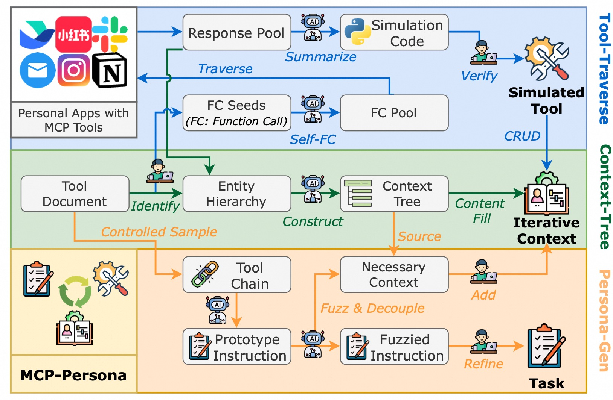
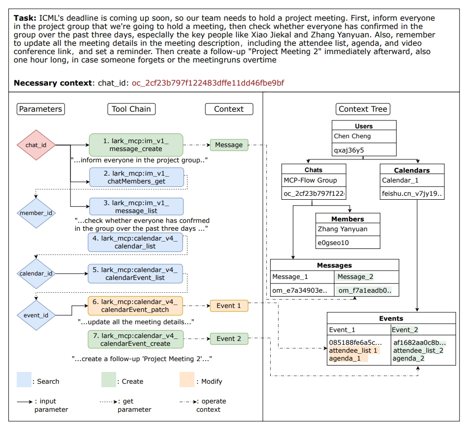
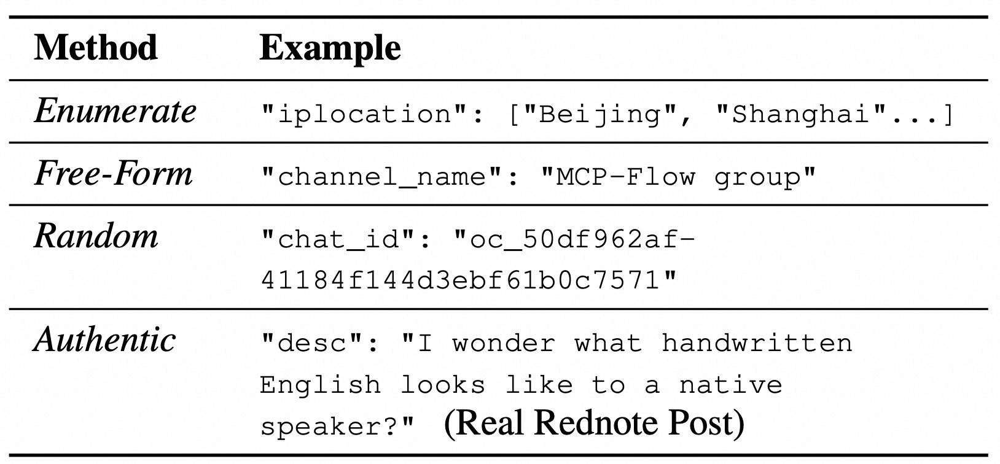
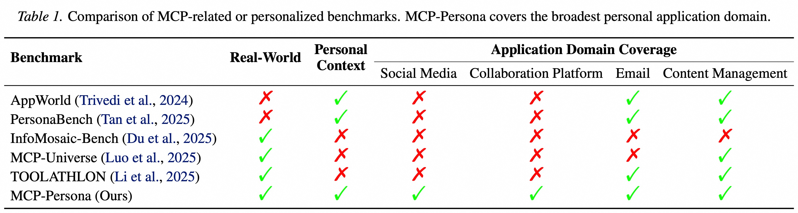
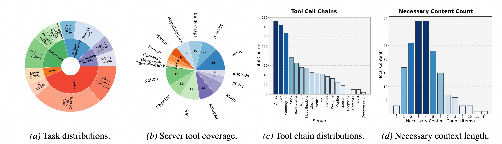

<div align="center">

# MCP-Persona

### Benchmarking LLM Agents on Real-World Personal Applications via Environment Simulation

[](https://arxiv.org/abs/2606.02470)
[](https://icml.cc/virtual/2026)
[](LICENSE)


</div>

---

## 🗞️ News

- **[2026-06-01]** Paper released on [arXiv](https://arxiv.org/abs/2606.02470).
- **[2026-05-01]** MCP-Persona accepted at **ICML 2026** 🎉!

---

## 📝 Introduction

**MCP-Persona** is a benchmark for evaluating LLM agent performance on **real-world, personalized MCP tools and tasks**. Unlike prior benchmarks that rely on simplified or synthetic environments, MCP-Persona simulates authentic personal application contexts — covering social media, collaboration platforms, email, and content management — through a fully automated, three-stage pipeline.

<p align="center">
  
</p>

The pipeline consists of three stages:
- **Tool-Traverse** — Crawls real MCP servers and synthesizes stable, verified simulation code for each tool.
- **Context-Tree** — Builds a structured entity hierarchy from tool documents and fills it with realistic, personalized context data (using Enumerate / Free-Form / Random / Authentic strategies).
- **Persona-Gen** — Generates fuzzed, persona-grounded task instructions that require multi-step tool chains to solve.

---

## ✨ Key Features

### Simulated tools with stateful, personalized contexts

We build a sandboxed simulation environment so that all tool operations remain stable, reproducible, and safe — no live credentials or real user data required.

<p align="center">
  
</p>

### Context filling strategies

Context is populated through four complementary methods that together produce realistic and diverse user states:

<p align="center">
  
</p>

### Broader coverage than existing benchmarks

MCP-Persona is the **only** MCP benchmark that simultaneously provides real-world tools, personal context, and coverage across Social Media, Collaboration Platforms, Email, and Content Management.

<p align="center">
  
</p>

### Rich dataset statistics

173 tool-chain tasks spanning 139 unique tools across 18 MCP servers, with diverse chain lengths and necessary context counts.

<p align="center">
  
</p>

---

## 📂 Data & Code

| Category           | Path                       | Description                                                                 |
| ------------------ | -------------------------- | --------------------------------------------------------------------------- |
| 📋 Tasks           | `./data/tasks`             | Benchmark tasks used to evaluate agents.                                    |
| 🔧 Simulated Tools | `./data/simulated_tools`   | Simulated Python tools emulating MCP server behavior with stateful context. |
| 📐 Context Schema  | `./data/context_schema/`   | Schema definitions for filling user/context state (e.g. Lark, Xiaohongshu). |
| 💻 Source Code     | `./src/`                   | Core scripts for building and deploying simulated MCP servers.              |
| 🧪 Evaluation Code | `./eval/`                  | Scripts for running benchmark evaluation (checkpoint and execution).        |

---

## 🛠️ Installation

```bash
git clone https://github.com/wenhao728/MCP-Persona.git
cd MCP-Persona
pip install -r requirements.txt
```

---

## 📄 Citation

If you find MCP-Persona useful in your research, please cite:

```bibtex
@misc{wang2026mcppersonabenchmarkingllmagents,
      title={MCP-Persona: Benchmarking LLM Agents on Real-World Personal Applications via Environment Simulation}, 
      author={Wenhao Wang and Peizhi Niu and Gongyi Zou and Xiyuan Yang and Jingxing Wang and Haoting Shi and Yaxin Du and Jingyi Chai and Xianghe Pang and Shuo Tang and Yanfeng Wang and Siheng Chen},
      year={2026},
      eprint={2606.02470},
      archivePrefix={arXiv},
      primaryClass={cs.AI},
      url={https://arxiv.org/abs/2606.02470}, 
}
```

---

<div align="center">
  <sub>Questions or issues? Feel free to open a GitHub issue.</sub>
</div>
